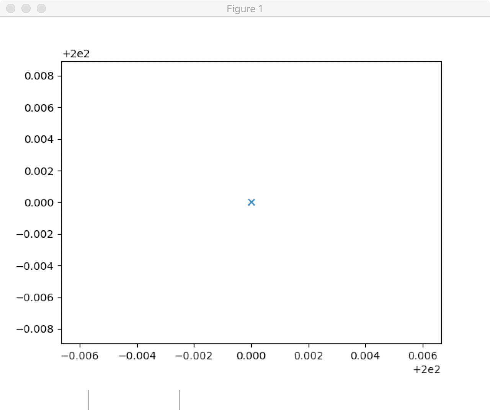
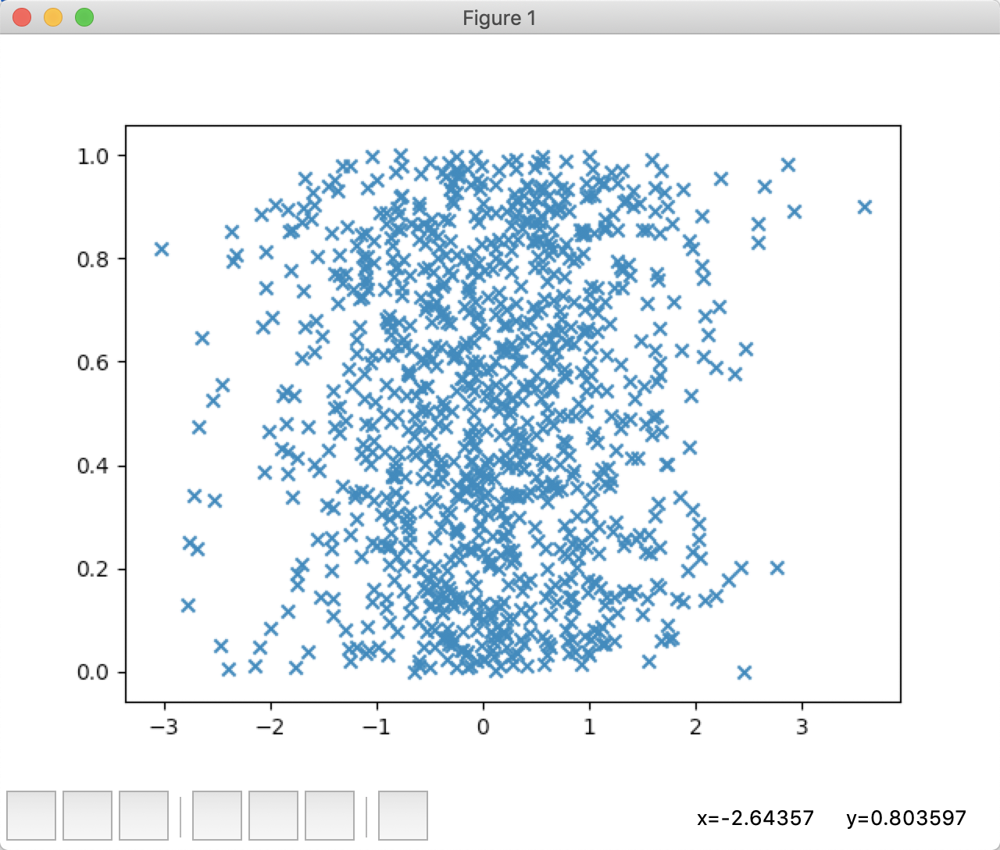
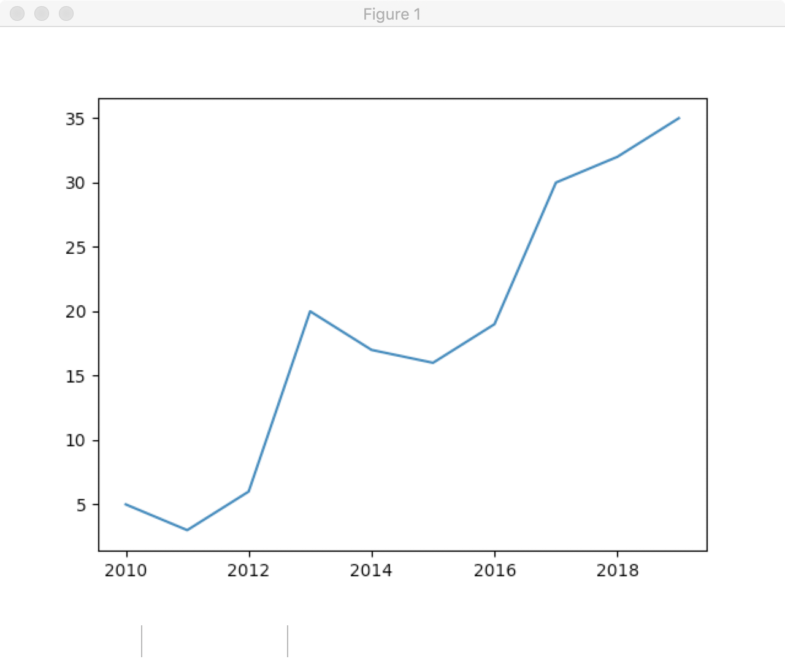
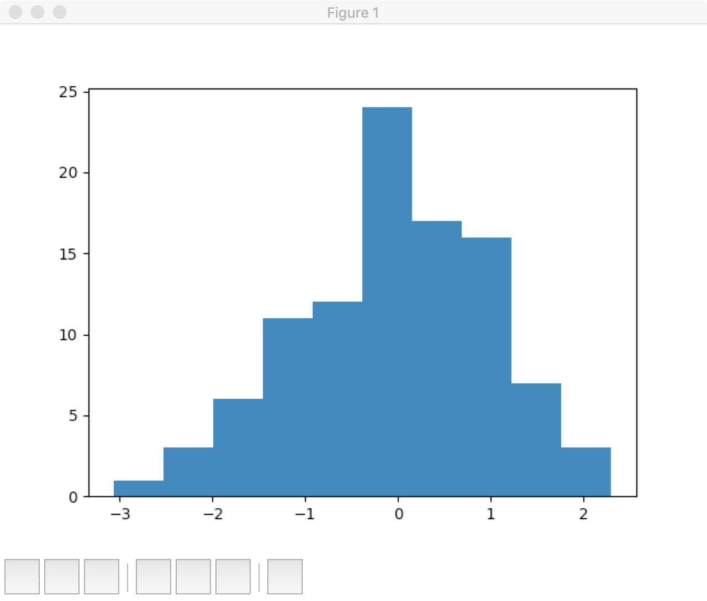
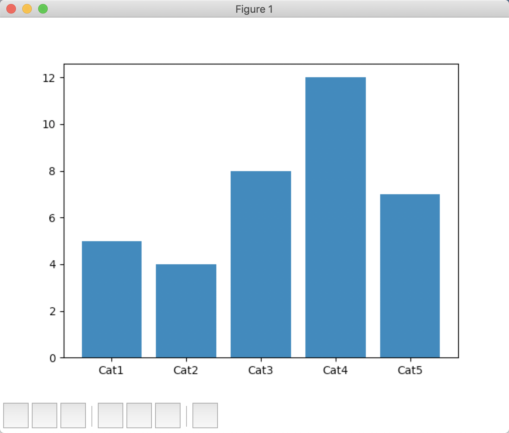
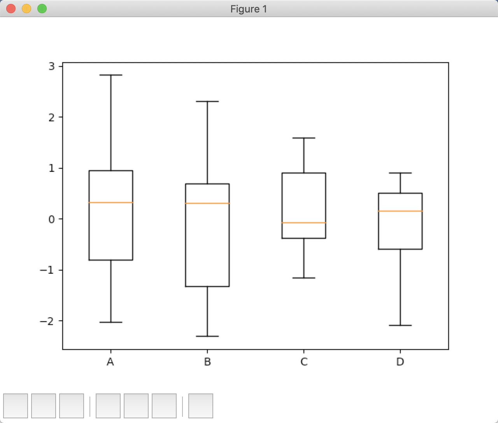

## 一次学会Python数据可视化的10种技能


## 1. 散点图

1、使用局部点渲染 散点图



[代码](./ScatterPlot.py)

```python
# encoding:utf-8
import matplotlib
matplotlib.use('Qt4Agg')
import matplotlib.pyplot as plt

## 散点图

plt.scatter(200,200,marker='x')
plt.show()


```

## 2、使用随机点生成散点图


[代码](./useseaborn.py)

```python
# encoding:utf-8
import matplotlib

matplotlib.use('Qt4Agg')
import numpy as np
import pandas as pd
import matplotlib.pyplot as plt
# import seaborn as sns

# sns.set(style="darkgrid")

N = 1000
x = np.random.randn(N)
y = np.random.rand(N)

## use matplotlib
plt.scatter(x, y, marker='x')
plt.show()

## use seaborn

# df = pd.DataFrame({'x': x, 'y': y})
#
# sns.jointplot(x='x', y='y', data=df, kind='scatter')
# plt.show()

```

## 3. 折线图

[代码](./lineChart.py)

```python
# encoding:utf-8

import matplotlib

matplotlib.use('Qt4Agg')
import numpy as np
import pandas as pd
import matplotlib.pyplot as plt
## 准备数据
x = range(2010,2020,1)
print x
y = [5,3,6,20,17,16,19,30,32,35]

plt.plot(x,y)
plt.show()
```

## 4.  直方图


[代码](./histogram.py)

```python
import matplotlib

matplotlib.use('Qt4Agg')
import numpy as np
import pandas as pd
import matplotlib.pyplot as plt

a = np.random.randn(100)
s = pd.Series(a)

plt.hist(s)
plt.show()
```

## 5. 条形图

[代码](./diagram.py)

```python
# encoding:utf-8
import matplotlib

matplotlib.use('Qt4Agg')
import numpy as np
import pandas as pd
import matplotlib.pyplot as plt

## 数据准备

x = ['Cat1', 'Cat2', 'Cat3', 'Cat4','Cat5' ]
y = [5, 4, 8, 12, 7]

plt.bar(x, y)
plt.show()

```

## 6. 箱线图


[代码](./diagram.py)

```python
# encoding:utf-8
import matplotlib

matplotlib.use('Qt4Agg')
import numpy as np
import pandas as pd
import matplotlib.pyplot as plt

## 数据准备

x = ['Cat1', 'Cat2', 'Cat3', 'Cat4','Cat5' ]
y = [5, 4, 8, 12, 7]

plt.bar(x, y)
plt.show()

```

## 7.  饼图


[代码](./pie.py)

```python
# encoding:utf-8

import matplotlib

matplotlib.use('Qt4Agg')
import numpy as np
import pandas as pd
import matplotlib.pyplot as plt

nums = [25, 37, 33, 37, 6]
labels = ['High-school', 'Bachelor', 'Master', 'Ph.d', 'Others']
plt.pie(x=nums, labels=labels)
plt.show()
```

## 8.  热力图


[代码](./none.py)

## 9. 热力图


[代码](./pie.py)

## 10. 蜘蛛图


[代码](./spider.py)

```python
# encoding:utf-8

import matplotlib

matplotlib.use('Qt4Agg')
import numpy as np
import pandas as pd
import matplotlib.pyplot as plt
# import seaborn as sns
from matplotlib.font_manager import FontProperties
# 数据准备
labels=np.array([u" 推进 ","KDA",u" 生存 ",u" 团战 ",u" 发育 ",u" 输出 "])
stats=[83, 61, 95, 67, 76, 88]
# 画图数据准备，角度、状态值
angles=np.linspace(0, 2*np.pi, len(labels), endpoint=False)
stats=np.concatenate((stats,[stats[0]]))
angles=np.concatenate((angles,[angles[0]]))
# 用 Matplotlib 画蜘蛛图
fig = plt.figure()
ax = fig.add_subplot(111, polar=True)
ax.plot(angles, stats, 'o-', linewidth=2)
ax.fill(angles, stats, alpha=0.25)
# 设置中文字体
# font = FontProperties(fname=r"C:\Windows\Fonts\simhei.ttf", size=14)
# ax.set_thetagrids(angles * 180/np.pi, labels, FontProperties=font)
plt.show()
```