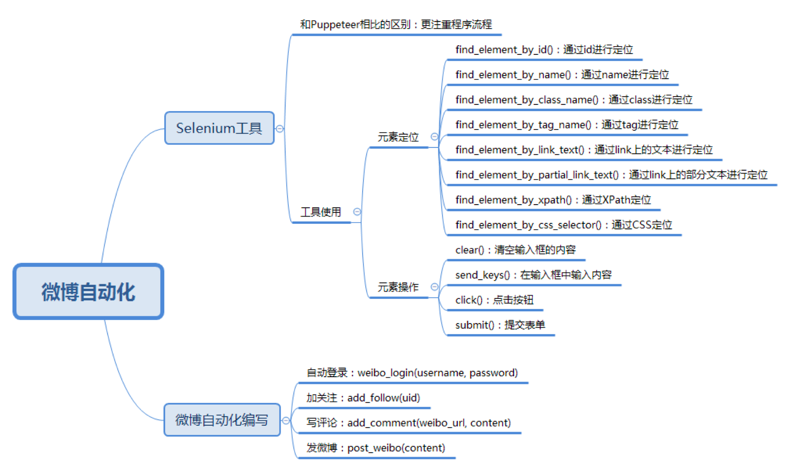

## Python 自动化运营微博


### Selenium 自动化测试工具
#### 定位元素
1. 通过 `id` 定位

```python
find_element_by_id()

```

2. 通过 name 定位

```python
find_element_by_name()

```

3.通过 `class` 定位

```python
find_element_by_class_name()

```

4. 通过 tag 定位

```python
find_element_by_tag_name()

```
5. 通过 `link` 完整文本定位

```python
find_element_by_link_text()

```

6.  通过 `link` 部分文本定位

```python
find_element_by_partial_link_text()

```

7. 通过 xpath 定位

```python
find_element_by_xpath()
```
8. 通过 css 定位

```python
find_element_by_css_selector()
```

#### 对元素进行操作

1. 清空输入框的内容

```python
clear()
```

2. 在输入框中输入内容

```python
send_keys(content)
```
3. 点击按钮

```python
click()
```

4. 提交表单

```python
submit()
```

## 加关注 写评论 发微博

[实例代码](weibo.py)

```python
from selenium import webdriver
import time

browser = webdriver.Chrome()


# 登录微博
def weibo_login(username, password):
  # 打开微博登录页
  browser.get('https://passport.weibo.cn/signin/login')
  browser.implicitly_wait(5)
  time.sleep(1)
  # 填写登录信息：用户名、密码
  browser.find_element_by_id("loginName").send_keys(username)
  browser.find_element_by_id("loginPassword").send_keys(password)
  time.sleep(1)
  # 点击登录
  browser.find_element_by_id("loginAction").click()
  time.sleep(1)


# 设置用户名、密码
username = 'XXXX'
password = "XXXX"
weibo_login(username, password)


# 添加指定的用户
def add_follow(uid):
  browser.get('https://m.weibo.com/u/' + str(uid))
  time.sleep(1)
  # browser.find_element_by_id("follow").click()
  follow_button = browser.find_element_by_xpath('//div[@class="m-add-box m-followBtn"]')
  follow_button.click()
  time.sleep(1)
  # 选择分组
  group_button = browser.find_element_by_xpath('//div[@class="m-btn m-btn-white m-btn-text-black"]')
  group_button.click()
  time.sleep(1)


# 每天学点心理学 UID
uid = '1890826225'
add_follow(uid)


# 给指定某条微博添加内容
def add_comment(weibo_url, content):
  browser.get(weibo_url)
  browser.implicitly_wait(5)
  content_textarea = browser.find_element_by_css_selector("textarea.W_input").clear()
  content_textarea = browser.find_element_by_css_selector("textarea.W_input").send_keys(content)
  time.sleep(2)
  comment_button = browser.find_element_by_css_selector(".W_btn_a").click()
  time.sleep(1)


# 发文字微博
def post_weibo(content):
  # 跳转到用户的首页
  browser.get('https://weibo.com')
  browser.implicitly_wait(5)
  # 点击右上角的发布按钮
  post_button = browser.find_element_by_css_selector("[node-type='publish']").click()
  # 在弹出的文本框中输入内容
  content_textarea = browser.find_element_by_css_selector("textarea.W_input").send_keys(content)
  time.sleep(2)
  # 点击发布按钮
  post_button = browser.find_element_by_css_selector("[node-type='submit']").click()
  time.sleep(1)


# 给指定的微博写评论
weibo_url = 'https://weibo.com/1890826225/HjjqSahwl'
content = 'Gook Luck! 好运已上路！'
# 自动发微博
content = '每天学点心理学'
post_weibo(content)

```

### 如何获取UID

点击任何一个微博用户
u 后面的数字就是用户的UID
```
https://weibo.com/u/5020181423...

```

大 V 分类  点击他的粉丝即可查看 UID
```
https://weibo.com/1890826225/f...

```

### 如何使用Xpath 获取路径

使用 chrome 调试工具 检查


### 总结


