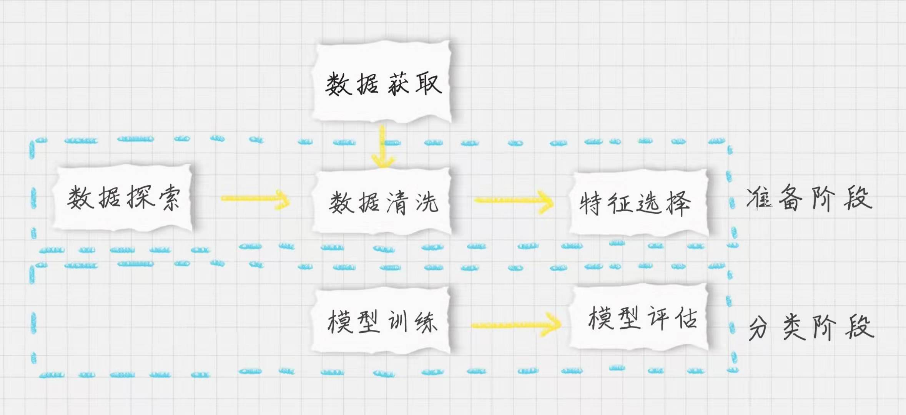

## 切割微信启动图 默认
>  切割图像流程和分类差不多:



 [切割图片源码](./kmeans-master/kmeans1.py)
 
```python
# -*- coding: utf-8 -*-
# 使用K-means对图像进行聚类，显示分割标识的可视化
import numpy as np
import PIL.Image as image
from sklearn.cluster import KMeans
from sklearn import preprocessing

# 加载图像，并对数据进行规范化
def load_data(filePath):
    # 读文件
    f = open(filePath,'rb')
    data = []
    # 得到图像的像素值
    img = image.open(f)
    # 得到图像尺寸
    width, height = img.size
    for x in range(width):
        for y in range(height):
            # 得到点(x,y)的三个通道值
            c1, c2, c3 = img.getpixel((x, y))
            data.append([c1, c2, c3])
    f.close()
    # 采用Min-Max规范化
    mm = preprocessing.MinMaxScaler()
    data = mm.fit_transform(data)
    return np.mat(data), width, height

# 加载图像，得到规范化的结果img，以及图像尺寸
img, width, height = load_data('./weixin.jpg')

# 用K-Means对图像进行2聚类
kmeans =KMeans(n_clusters=2)
kmeans.fit(img)
label = kmeans.predict(img)
# 将图像聚类结果，转化成图像尺寸的矩阵
label = label.reshape([width, height])
# 创建个新图像pic_mark，用来保存图像聚类的结果，并设置不同的灰度值
pic_mark = image.new("L", (width, height))
for x in range(width):
    for y in range(height):
        # 根据类别设置图像灰度, 类别0 灰度值为255， 类别1 灰度值为127
        pic_mark.putpixel((x, y), int(256/(label[x][y]+1))-1)
pic_mark.save("weixin_mark.jpg", "JPEG")
```

切割之后图片预览：


## 切割成为16部分 染色
 [切割16份图片源码](./kmeans-master/kmeans2.py)

```python
# -*- coding: utf-8 -*-
# 使用K-means对图像进行聚类，显示分割标识的可视化
import numpy as np
import PIL.Image as image
from sklearn.cluster import KMeans
from sklearn import preprocessing
from skimage import color

# 加载图像，并对数据进行规范化
def load_data(filePath):
    # 读文件
    f = open(filePath,'rb')
    data = []
    # 得到图像的像素值
    img = image.open(f)
    # 得到图像尺寸
    width, height = img.size
    for x in range(width):
        for y in range(height):
            # 得到点(x,y)的三个通道值
            c1, c2, c3 = img.getpixel((x, y))
            data.append([c1, c2, c3])
    f.close()
    # 采用Min-Max规范化
    mm = preprocessing.MinMaxScaler()
    data = mm.fit_transform(data)
    return np.mat(data), width, height

# 加载图像，得到规范化的结果img，以及图像尺寸
img, width, height = load_data('./weixin.jpg')

# 用K-Means对图像进行16聚类
kmeans =KMeans(n_clusters=16)
kmeans.fit(img)
label = kmeans.predict(img)
# 将图像聚类结果，转化成图像尺寸的矩阵
label = label.reshape([width, height])
# 将聚类标识矩阵转化为不同颜色的矩阵
label_color = (color.label2rgb(label)*255).astype(np.uint8)
label_color = label_color.transpose(1,0,2)
images = image.fromarray(label_color)
images.save('weixin_mark_color.jpg')
```

预览：


## 聚类可视化还原为质心点
[还原](./kmeans-master/kmeans3.py)

```python
# -*- coding: utf-8 -*-
# 使用K-means对图像进行聚类，并显示聚类压缩后的图像
import numpy as np
import PIL.Image as image
from sklearn.cluster import KMeans
from sklearn import preprocessing
import matplotlib.image as mpimg
# 加载图像，并对数据进行规范化
def load_data(filePath):
    # 读文件
    f = open(filePath,'rb')
    data = []
    # 得到图像的像素值
    img = image.open(f)
    # 得到图像尺寸
    width, height = img.size
    for x in range(width):
        for y in range(height):
            # 得到点(x,y)的三个通道值
            c1, c2, c3 = img.getpixel((x, y))
            data.append([(c1+1)/256.0, (c2+1)/256.0, (c3+1)/256.0])
    f.close()
    return np.mat(data), width, height
# 加载图像，得到规范化的结果imgData，以及图像尺寸
img, width, height = load_data('./weixin.jpg')
# 用K-Means对图像进行16聚类
kmeans =KMeans(n_clusters=16)
label = kmeans.fit_predict(img)
# 将图像聚类结果，转化成图像尺寸的矩阵
label = label.reshape([width, height])
# 创建个新图像img，用来保存图像聚类压缩后的结果
img=image.new('RGB', (width, height))
for x in range(width):
    for y in range(height):
        c1 = kmeans.cluster_centers_[label[x, y], 0]
        c2 = kmeans.cluster_centers_[label[x, y], 1]
        c3 = kmeans.cluster_centers_[label[x, y], 2]
        img.putpixel((x, y), (int(c1*256)-1, int(c2*256)-1, int(c3*256)-1))
img.save('weixin_new.jpg')
```

预览：


