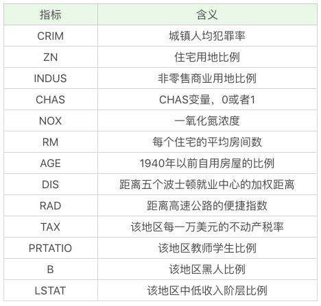

## 分类 和 回归

- 本质：对事物做预测
- 不同： 输出的结果类型
  - 分类
    - 离散值
  - 回归
    - 连续值
 
 ## 1. 使用 `AdaBoost` 工具
 
 ```python
from sklearn.ensemble import AdaBoostClassifier

```

## 放假预测

我们看下 `sklearn` 中自带的波士顿房价数据集。

13项指标




## 运算过程

1. 加载数据

2. 分隔数据为训练集和测试集

3. 创建 `AdaBoost` 回归模型

4. 传入训练集数据进行拟合

5. 传入测试数据集进行预测


### 代码

  [示例代码](demo1.py)
  
```python
from sklearn.model_selection import train_test_split
from sklearn.metrics import mean_squared_error
from sklearn.datasets import load_boston
from sklearn.ensemble import AdaBoostRegressor
# 加载数据
data=load_boston()
# 分割数据
train_x, test_x, train_y, test_y = train_test_split(data.data, data.target, test_size=0.25, random_state=33)
# 使用 AdaBoost 回归模型
regressor=AdaBoostRegressor()
regressor.fit(train_x,train_y)
pred_y = regressor.predict(test_x)
mse = mean_squared_error(test_y, pred_y)
print(" 房价预测结果 ", pred_y)
print('*'*30)
print(" 均方误差 = ",round(mse,2))

```
  
## 使用决策树和回归树

   [示例代码](demo2.py)

```python
from sklearn.model_selection import train_test_split
from sklearn.metrics import mean_squared_error
from sklearn.datasets import load_boston
from sklearn.ensemble import AdaBoostRegressor
from sklearn.neighbors import KNeighborsRegressor
from sklearn.tree import DecisionTreeRegressor
# 加载数据
data=load_boston()
# 分割数据
train_x, test_x, train_y, test_y = train_test_split(data.data, data.target, test_size=0.25, random_state=33)
# 使用 AdaBoost 回归模型
regressor=AdaBoostRegressor()
regressor.fit(train_x,train_y)
pred_y = regressor.predict(test_x)
mse = mean_squared_error(test_y, pred_y)
# 使用决策树回归模型
dec_regressor=DecisionTreeRegressor()
dec_regressor.fit(train_x,train_y)
pred_y = dec_regressor.predict(test_x)
mse = mean_squared_error(test_y, pred_y)
print(" 决策树均方误差 = ",round(mse,2))
'''
 决策树均方误差 =  28.19
'''
# 使用 KNN 回归模型
knn_regressor=KNeighborsRegressor()
knn_regressor.fit(train_x,train_y)
pred_y = knn_regressor.predict(test_x)
mse = mean_squared_error(test_y, pred_y)
print("KNN 均方误差 = ",round(mse,2))
'''
KNN 均方误差 =  27.87

'''

```   
   
## AdaBoost 与决策树模型的比较

   [官方代码](demo3.py)
   
```python
import numpy as np
import matplotlib.pyplot as plt
from sklearn import datasets
from sklearn.metrics import zero_one_loss
from sklearn.tree import DecisionTreeClassifier
from sklearn.ensemble import AdaBoostClassifier

# 设置 AdaBoost 迭代次数
n_estimators = 200
# 使用
X, y = datasets.make_hastie_10_2(n_samples=12000, random_state=1)
# 从 12000 个数据中取前 2000 行作为测试集，其余作为训练集
test_x, test_y = X[2000:], y[2000:]
train_x, train_y = X[:2000], y[:2000]
# 弱分类器
dt_stump = DecisionTreeClassifier(max_depth=1, min_samples_leaf=1)
dt_stump.fit(train_x, train_y)
dt_stump_err = 1.0 - dt_stump.score(test_x, test_y)
# 决策树分类器
dt = DecisionTreeClassifier()
dt.fit(train_x, train_y)
dt_err = 1.0 - dt.score(test_x, test_y)
# AdaBoost 分类器
ada = AdaBoostClassifier(base_estimator=dt_stump, n_estimators=n_estimators)
ada.fit(train_x, train_y)
# 三个分类器的错误率可视化
fig = plt.figure()
# 设置 plt 正确显示中文
plt.rcParams['font.sans-serif'] = ['SimHei']
ax = fig.add_subplot(111)
ax.plot([1, n_estimators], [dt_stump_err] * 2, 'k-', label=u'决策树弱分类器 错误率')
ax.plot([1, n_estimators], [dt_err] * 2, 'k--', label=u'决策树模型 错误率')
ada_err = np.zeros((n_estimators,))
# 遍历每次迭代的结果 i 为迭代次数, pred_y 为预测结果
for i, pred_y in enumerate(ada.staged_predict(test_x)):
  # 统计错误率
  ada_err[i] = zero_one_loss(pred_y, test_y)
# 绘制每次迭代的 AdaBoost 错误率
ax.plot(np.arange(n_estimators) + 1, ada_err, label='AdaBoost Test 错误率', color='orange')
ax.set_xlabel('迭代次数')
ax.set_ylabel('错误率')
leg = ax.legend(loc='upper right', fancybox=True)
plt.show()

```   
   [pipenv 代码](demo3-1.py)

```python
import numpy as np
import matplotlib

matplotlib.use('Qt4Agg')
import matplotlib.pyplot as plt
from sklearn import datasets
from sklearn.metrics import zero_one_loss
from sklearn.tree import DecisionTreeClassifier
from sklearn.ensemble import AdaBoostClassifier

# 设置 AdaBoost 迭代次数
n_estimators = 200
# 使用
X, y = datasets.make_hastie_10_2(n_samples=12000, random_state=1)
# 从 12000 个数据中取前 2000 行作为测试集，其余作为训练集
test_x, test_y = X[2000:], y[2000:]
train_x, train_y = X[:2000], y[:2000]
# 弱分类器
dt_stump = DecisionTreeClassifier(max_depth=1, min_samples_leaf=1)
dt_stump.fit(train_x, train_y)
dt_stump_err = 1.0 - dt_stump.score(test_x, test_y)
# 决策树分类器
dt = DecisionTreeClassifier()
dt.fit(train_x, train_y)
dt_err = 1.0 - dt.score(test_x, test_y)
# AdaBoost 分类器
ada = AdaBoostClassifier(base_estimator=dt_stump, n_estimators=n_estimators)
ada.fit(train_x, train_y)
# 三个分类器的错误率可视化
fig = plt.figure()
# 设置 plt 正确显示中文
plt.rcParams['font.sans-serif'] = ['SimHei']
ax = fig.add_subplot(111)
ax.plot([1, n_estimators], [dt_stump_err] * 2, 'k-', label=u'决策树弱分类器 错误率')
ax.plot([1, n_estimators], [dt_err] * 2, 'k--', label=u'决策树模型 错误率')
ada_err = np.zeros((n_estimators,))
# 遍历每次迭代的结果 i 为迭代次数, pred_y 为预测结果
for i, pred_y in enumerate(ada.staged_predict(test_x)):
  # 统计错误率
  ada_err[i] = zero_one_loss(pred_y, test_y)
# 绘制每次迭代的 AdaBoost 错误率
ax.plot(np.arange(n_estimators) + 1, ada_err, label='AdaBoost Test 错误率', color='orange')
ax.set_xlabel('迭代次数')
ax.set_ylabel('错误率')
leg = ax.legend(loc='upper right', fancybox=True)
plt.show()

```   
   
## 总结


   