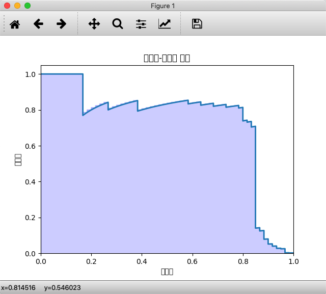

## 信用卡诈骗分析

问题

 1. 比例更小
 2. 危害更大

## 掌握

1.  逻辑回归分类
2. 二分类问题，什么模型评估更准确
3. 实战项目

## 构建逻辑回归分类器

1. 概念

逻辑回归

`logistic` 回归,它实际上是分类方法，为了解决二分类问题。也可解决多分类问题

2. 函数公式


函数图形


- `z` 越大的时候，`g(z)` 越大，当 `z` 趋近于无穷大的时候，`g(z)` 趋近于 `1`

- `z` 趋近于无穷小的时候，`g(z)` 趋近于 0

- 函数值以 `0.5` 为中心

- `0` 即为不发生，`1` 即为发生

## 代码实现 `sklearn`

```python
LogisticRegression()

```

完整代码：

```python
# -*- coding:utf-8 -*-
# 使用逻辑回归对信用卡欺诈进行分类
import pandas as pd
import numpy as np
import seaborn as sns
import matplotlib.pyplot as plt
import itertools
from sklearn.linear_model import LogisticRegression
from sklearn.model_selection import train_test_split
from sklearn.metrics import confusion_matrix, precision_recall_curve
from sklearn.preprocessing import StandardScaler
import warnings

warnings.filterwarnings('ignore')


# 混淆矩阵可视化
def plot_confusion_matrix(cm, classes, normalize=False, title='Confusion matrix"', cmap=plt.cm.Blues):
  plt.figure()
  plt.imshow(cm, interpolation='nearest', cmap=cmap)
  plt.title(title)
  plt.colorbar()
  tick_marks = np.arange(len(classes))
  plt.xticks(tick_marks, classes, rotation=0)
  plt.yticks(tick_marks, classes)

  thresh = cm.max() / 2.
  for i, j in itertools.product(range(cm.shape[0]), range(cm.shape[1])):
    plt.text(j, i, cm[i, j],
             horizontalalignment='center',
             color='white' if cm[i, j] > thresh else 'black')

  plt.tight_layout()
  plt.ylabel('True label')
  plt.xlabel('Predicted label')
  plt.show()


# 显示模型评估结果
def show_metrics():
  tp = cm[1, 1]
  fn = cm[1, 0]
  fp = cm[0, 1]
  tn = cm[0, 0]
  print('精确率: {:.3f}'.format(tp / (tp + fp)))
  print('召回率: {:.3f}'.format(tp / (tp + fn)))
  print('F1值: {:.3f}'.format(2 * (((tp / (tp + fp)) * (tp / (tp + fn))) / ((tp / (tp + fp)) + (tp / (tp + fn))))))


# 绘制精确率-召回率曲线
def plot_precision_recall():
  plt.step(recall, precision, color='b', alpha=0.2, where='post')
  plt.fill_between(recall, precision, step='post', alpha=0.2, color='b')
  plt.plot(recall, precision, linewidth=2)
  plt.xlim([0.0, 1])
  plt.ylim([0.0, 1.05])
  plt.xlabel('召回率')
  plt.ylabel('精确率')
  plt.title('精确率-召回率 曲线')
  plt.show();


# 数据加载
data = pd.read_csv('./creditcard.csv')
# 数据探索
print(data.describe())
# 设置plt正确显示中文
plt.rcParams['font.sans-serif'] = ['SimHei']
# 绘制类别分布
plt.figure()
ax = sns.countplot(x='Class', data=data)
plt.title('类别分布')
plt.show()
# 显示交易笔数，欺诈交易笔数
num = len(data)
num_fraud = len(data[data['Class'] == 1])
print('总交易笔数: ', num)
print('诈骗交易笔数：', num_fraud)
print('诈骗交易比例：{:.6f}'.format(num_fraud / num))
# 欺诈和正常交易可视化
f, (ax1, ax2) = plt.subplots(2, 1, sharex=True, figsize=(15, 8))
bins = 50
ax1.hist(data.Time[data.Class == 1], bins=bins, color='deeppink')
ax1.set_title('诈骗交易')
ax2.hist(data.Time[data.Class == 0], bins=bins, color='deepskyblue')
ax2.set_title('正常交易')
plt.xlabel('时间')
plt.ylabel('交易次数')
plt.show()
# 对Amount进行数据规范化
data['Amount_Norm'] = StandardScaler().fit_transform(data['Amount'].values.reshape(-1, 1))
# 特征选择
y = np.array(data.Class.tolist())
data = data.drop(['Time', 'Amount', 'Class'], axis=1)
X = np.array(data.as_matrix())
# 准备训练集和测试集
train_x, test_x, train_y, test_y = train_test_split(X, y, test_size=0.1, random_state=33)

# 逻辑回归分类
clf = LogisticRegression()
clf.fit(train_x, train_y)
predict_y = clf.predict(test_x)
# 预测样本的置信分数
score_y = clf.decision_function(test_x)
# 计算混淆矩阵，并显示
cm = confusion_matrix(test_y, predict_y)
class_names = [0, 1]
# 显示混淆矩阵
plot_confusion_matrix(cm, classes=class_names, title='逻辑回归 混淆矩阵')
# 显示模型评估分数
show_metrics()
# 计算精确确率，召回率，阈值用于可视化
precision, recall, thresholds = precision_recall_curve(test_y, score_y)
plot_precision_recall()

```

参数：

- `penalty`：惩罚项，取值为 l1 或 l2，默认为 l2...
- `solver`：代表的是逻辑回归损失函数的优化方法
- `max_iter`：算法收敛的最大迭代次数
- `n_jobs`：拟合和预测的时候 CPU 的核数，默认是 1

模型评估指标

评估模型的好坏

F1


F1 作为精确率 P 和召回率 R 的调和平均

数值越大代表模型的结果越好

分析步骤


总量


诈骗交易 && 正常交易


```
总交易笔数:  284807
诈骗交易笔数： 492
诈骗交易比例：0.001727
```

 逻辑回归 混淆矩阵


 精准率 召回率



## 说明

混淆矩阵

混淆矩阵也叫误差矩阵，实际上它就是 TP、FP、TN、FN 这四个数值的矩阵表示


`precision_recall_curve` 函数，预测值和真实值来计算精确率 - 召回率曲线

`precision_recall_curve` 函数会计算在不同概率阈值情况下的精确率和召回率


## 总结


